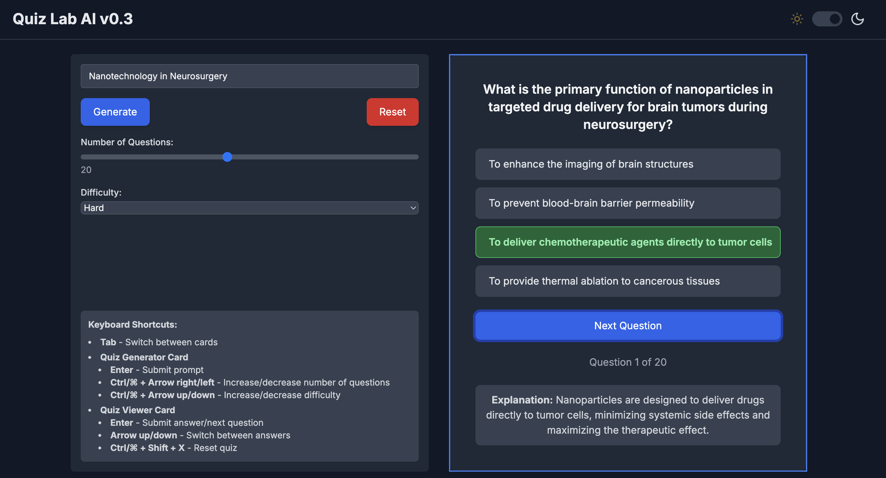

# 🧠 Quiz Lab AI  

**AI-powered quiz generator** for studying and exam preparation. Generate **ABCD multiple-choice questions** on **any topic, in any language** with AI.  

  

**Powered by Next.js and GPT-4o-mini.**  


## Features  

✅ **Dynamic Quiz Generation** – Create quizzes on any topic.  
✅ **Custom Difficulty Levels** – Adjust question difficulty to suit your learning needs.  
✅ **Custom Number of Questions** – Choose how many questions you want.  
✅ **Supports Multiple Languages** – Generate quizzes in any language.  

## Getting Started

### Install dependencies

 ```bash
 npm install
 ```

### Set Up Environment Variables
 
 - Rename env.local.example to env.local
 - Add your OpenAI API key inside .env.local

### Run the development server

```bash
npm run dev
```

## License
MIT License – Free to use and modify.